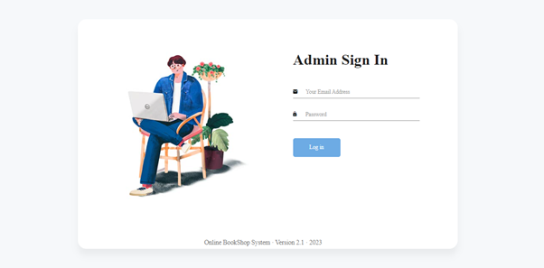
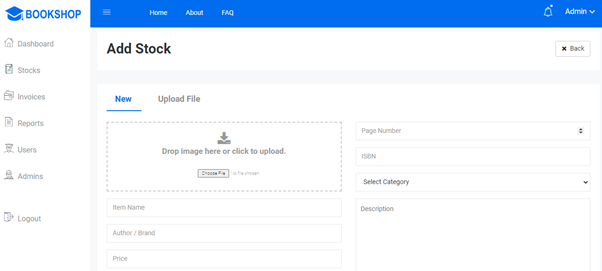
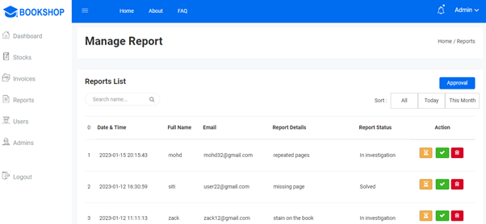
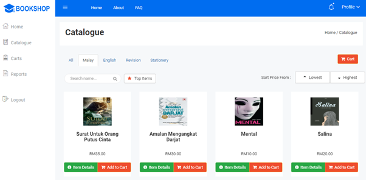

# Online Bookshop System

This Online Bookshop System is built using PHP, Bootstrap, MySQL, HTML, and CSS.

- User authentication: Users can sign in or register new accounts.

- Dashboard with interesting promotions and coupons to enhance user experience.

- Admin stock management: Easily manage stock and inventory.

- Efficient report handling: Admins can effectively handle reports from customers.

- Seamless shopping experience: Customers can view product details and add items to the cart effortlessly.

- Efficient checkout organization: Effortlessly organize items during checkout for smooth transactions.

And many more great features! Explore the system to discover more functionalities.
